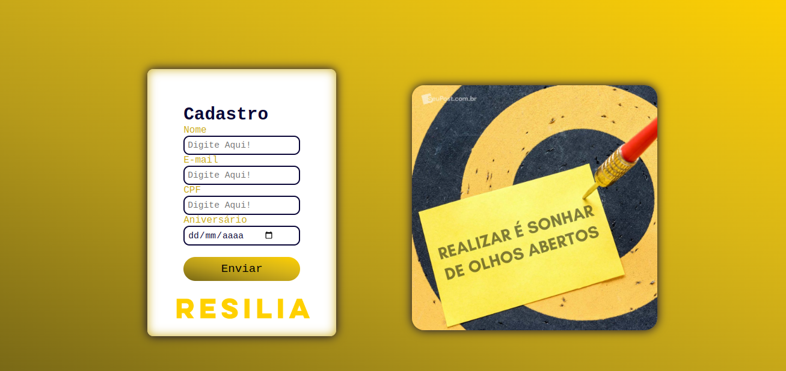
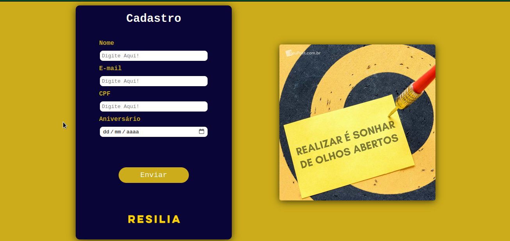
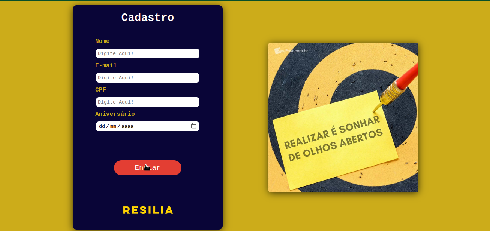
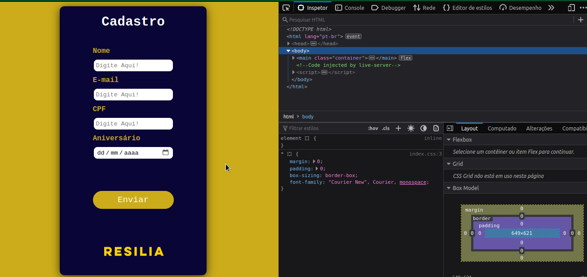

# 🚀 Desafio HTML e CSS
* Primeiro projeto do modulo I do curso de Web Dev da Resilia Educação.

## 🧠 Contexto
* O objetivo deste desafio é criar uma página de cadastro para o site da resilia

## 📋 Pré-requisitos

O projeto deverá seguir os seguintes itens:

* HTML,
* CSS
* Boostrap(Opcional)
* Layout responsivo(Opcional)

### Resultado

* link do deploy no github page: https://lipeqalves.github.io/formularioInscricao/
## 🛠️ Refatorando o projeto
 ### itens refatorados
 * adiciona responsividade
 * mudança na cor do formularios
 * ajuste no butão, colocando interação 
 * ajustes no input, uma regra minima de autenticação

 ### Resultado apos refatoração

* link do deploy na vercel: https://formulario-inscricao-mu.vercel.app/
